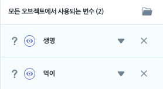
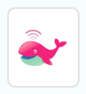
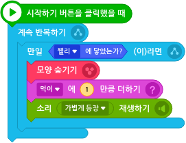

# 04. 상어를 피해라 

  

🎮  **오늘 만들 게임 완성본**   
[' ' 바로가기]() 

## 1. 게임 개요
>
- 이번 시간에는 방향키를 이용하여 움직이고 상어를 피해 먹이를 먹는 게임을 만들어봅니다.
- 변수를 설정하고 먹이 오브젝트에 닿으면 먹이 변수가 +1 되는 것, 상어 오브젝트에 닿으면 변수가 -1 되는 것 등의 기능을 만들어봅니다

## 2. 게임 제작하기

### 🧩 오브젝트 추가하기

- '바닷속'(배경), 상어, 노란 복어, 물고기, 등푸른 물고기, 주황 물고기, 파란 복어, 짧은 해파리, 웰리 오브젝트를 추가해줍니다. 

### 🧩 변수 추가하기
> 
- '생명', '먹이'라는 이름의 변수 추가 

### 🧩 웰리 
>    

> 

### 🧩 물고기 
> 

 

> 

### 🧩 상어 
> 

> 

### 🧩 종료 메세지 상자 만들기 
> 

> 

 요약 

