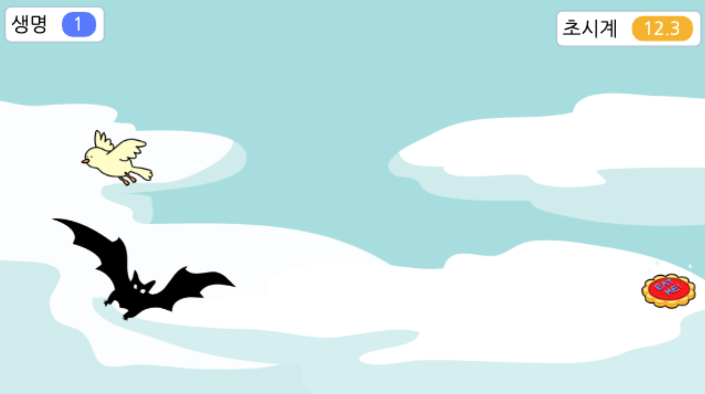

 # 05. 아기새를 지켜라 

🚩 오브젝트를 이동시키고, 숨기거나 보일 수 있으며 조건문, 변수, 타이머, 신호, 소리 등을 사용할 수 있습니다.

🎮  **오늘 만들 게임 완성본**   
[https://naver.me/](https://naver.me/) 

## 1. 게임 개요

- 이번 시간에는 오브젝트를 무작위 위치로 보내고, 변수와 타이머를 활용하여봅니다. 
- 아기새를 따라다니는 박쥐를 클릭하여 공격할 수 없게 만들어주고, 생명을 다 잃지 않고 30초를 버티면 승리합니다.

