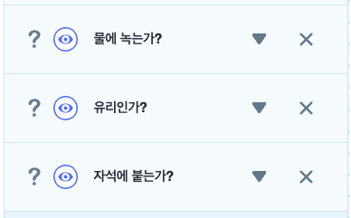

# 10. 자동 분리수거하기2

🚩 

🎮  **오늘 만들 게임 완성본**   
 

## 1. 게임 개요

- 

## 2. 게임 제작하기

### 🧩 오브젝트 추가하기

> 
-  오브젝트를 추가하세요.

### 🧩 신호 및 변수 추가하기 

**🛜 분석 신호**
- 속성에서 '분석'이라는 신호를 추가해주세요.

**📦 변수 추가**
> 
- '물에 녹는가?' , '유리인가?', '자석에 붙는가?' 라는 3개의 변수를 추가해주세요. 

 요약 

